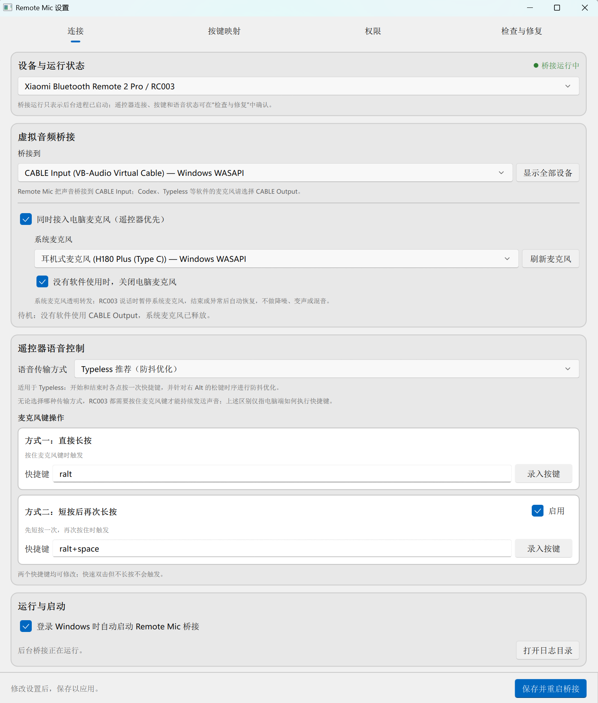
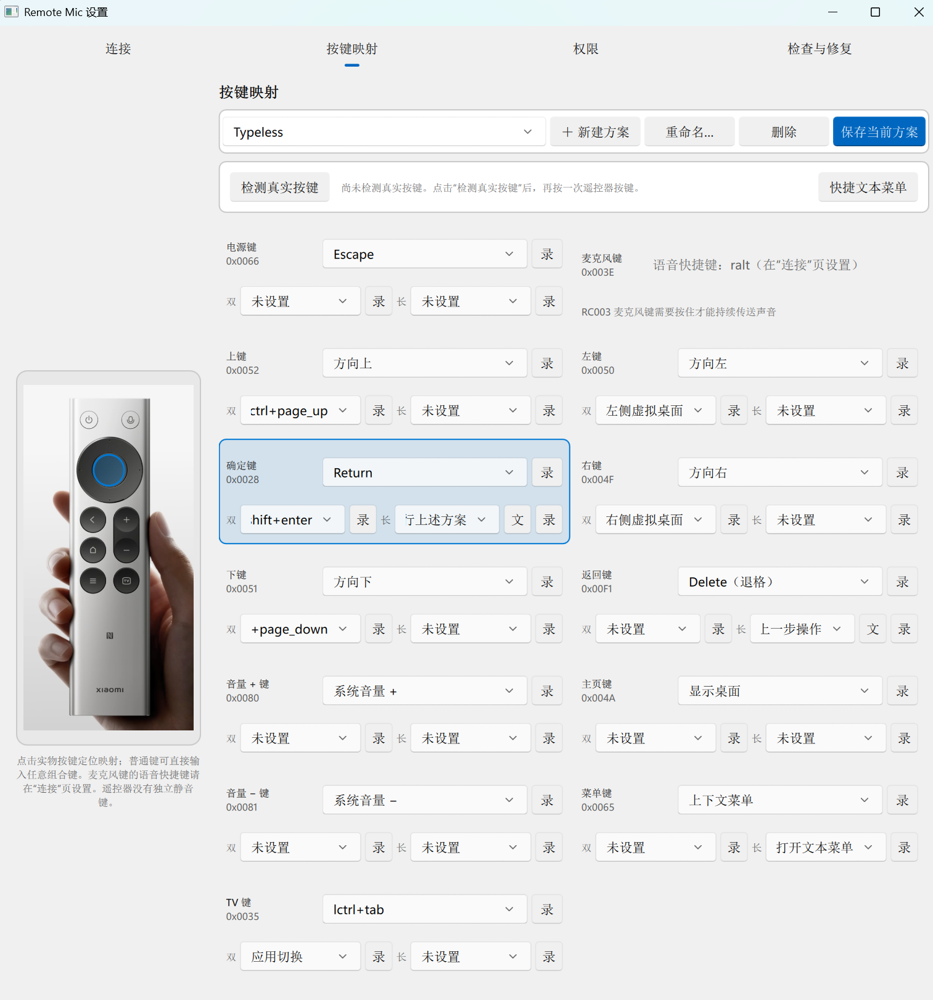

# Remote Mic — Windows client (RC003)

> **状态：已通过真实硬件验收的源码/构建候选。** 本目录包含
> 跨平台协议测试，以及针对 WinRT BLE、Raw Input、SendInput 和 PortAudio 的
> Windows CI/构建流程。CI 可以证明代码能够编译并通过 Windows API 调用契约
> 测试；此外，本候选已在真实小米蓝牙遥控器 2 Pro / RC003 上验证：方向键、
> OK、Home、Menu、TV、Power、返回、音量+、音量- 全部单次触发，麦克风键可
> 正常启动豆包输入法并识别语音。
> 当前产物未签名，也不会自动安装虚拟音频驱动。官方 Windows CI 候选会下载并
> 校验固定版本的 Frida Gadget 后随包携带；源码仓库不保存该二进制，本地自行构建
> 时仍需显式获取。VB-CABLE 驱动始终只在用户确认后安装（见下文）。

这是本仓库独立维护的 Windows RC003 客户端，面向小米蓝牙遥控器 2 Pro / RC003，
提供按键映射和 ATVV
（Android TV Voice-over-BLE）语音桥接。项目整体说明请阅读仓库根目录的
`README.md`。

设置窗口提供明确的设备选择器。选择 **小米 RC003** 时使用桥接、虚拟输出和
13 键映射界面；选择 **DJI Mic 2（Pocket 3 套装发射器）** 时切换到独立的
Windows 系统录音输入页面，绝不会启动 RC003 BLE/HID/ATVV 桥接。DJI 发射器
的录音、连接和电源键目前只作为只读硬件说明，尚未声称它们是可映射的 Windows
按键。

## 中文安装与使用说明

> 本节面向想要试用这个候选版本的用户；后面的技术说明用于开发者和维护者。
> 本候选已完成真实 RC003 真机验收（逐键、语音链路）；未签名，首次运行
> 可能触发 SmartScreen 提示。

### 界面截图





> 截图在 Windows 11 + RC003 实测环境拍摄；如与你的系统主题/分辨率不同属正常差异。

### 系统要求

- Windows 10 1809（内部版本 17763）或以上，64 位；
- 未签名安装包/可执行文件：首次运行时 Windows SmartScreen 可能提示
  "Windows 已保护你的电脑"——这是预期行为，不是错误，本项目目前没有代码
  签名证书。

  在点击"仍要运行"之前，建议先核对文件的 SHA-256 校验值是否与同一次构建
  产出的 `SHA256SUMS.txt` 一致。以 PowerShell 为例：

  ```powershell
  Get-FileHash -Algorithm SHA256 .\RemoteMicRC003Setup-<版本号>-unsigned.exe
  ```

  把输出的 `Hash` 值（不区分大小写）与 `SHA256SUMS.txt` 中同一个文件名那
  一行的哈希值逐字比较；只要有一个字符不一致就不要运行，重新下载或联系
  发布者核实。核对一致后，再点击 SmartScreen 提示中的"更多信息"，然后点击
  "仍要运行"。

### 获取构建产物

首选来源是本仓库的 Releases 列表页——这是列表页本身，不是指向某个具体
tag 的链接，因此始终是获取最新预发行版的稳定入口，请直接使用这个地址：

  https://github.com/miaomiaozii/windows-remote-mic-app/releases

在列表中找到本 RC003 Windows 候选对应的预发行版（预发行版会明确标记为
prerelease，发布说明会写清楚它基于哪一次真实 Windows CI 运行）。

预发行版的仓库级 tag（例如 `v0.3.0-windows-rc003-candidate.1`）只是发布
编号，和资产文件名里的内部构建版本号是两回事：当前内部构建版本号固定为
`0.1.0-hidtapfix.33`（HID tap、Typeless 直连、可配置麦克风键直接长按与短按后再次长按两种语音快捷方式、可手动输入或录制语音快捷键、紧凑连接页、虚拟音频设备优先列表、可选统一输入、按需系统麦克风、Vibe Coding 动作库、只读系统默认方案、自定义文本、极简快捷文本菜单、现代编辑器光标定位、桥接自动恢复、可选登录自启动、长按防重复及 CI 完整打包测试版，来自安装器脚本
`installer/RemoteMicRC003Setup.iss` 的 `AppVersion`）。不要因为
文件名里的版本号和 tag 不一致就怀疑下载错了文件，具体对应关系以该
预发行版自己的发布说明为准。

每个 RC003 Windows 候选预发行版恰好包含以下三个文件，文件名精确匹配这个模式（下面的
`<版本号>` 就是上面说的内部构建版本号，不是 tag）：

- `RemoteMicRC003Setup-<版本号>-unsigned.exe`——安装器；
- `RemoteMicRC003-<版本号>-portable-unsigned.zip`——便携版（解压后
  得到一个已带版本号的顶层文件夹，里面除程序本体外还包含
  LICENSE.txt/COPYRIGHT.txt/THIRD_PARTY_NOTICES.md/ATTRIBUTION.md/
  README.txt，和安装器携带的说明与授权文件相同）；
- `SHA256SUMS.txt`——覆盖以上两个文件的哈希清单，来自同一次构建，用于
  上一节"系统要求"所说的哈希核对。

只需要下载安装器**或**便携版其中一个，不需要两个都下载；两者内容等价，
都来自同一次真实 Windows CI 运行——安装器会安装到当前用户目录，便携版
解压即用、不需要安装。

也可以使用以下备选来源：

- `.github/workflows/windows-rc003-ci.yml` 在真实 Windows GitHub Actions
  runner 上产出的、结构相同的未签名便携版 ZIP、安装器 `.exe` 与
  `SHA256SUMS.txt`（作为该次 CI 运行的构建产物而不是正式发布，需要登录
  GitHub 账号后在对应 Actions 运行页面下载）——下载后同样请自行核对哈希
  再使用；
- 或在一台 Windows 机器上自行运行 `.\build\build-candidate.ps1` 从源码
  构建（见下方"Building an unsigned candidate"一节）。

### 安装

安装器和便携版是两种不同的使用方式，步骤不完全一样，分别说明如下；
后面"首次使用、停止/重启、卸载"一节也会按这两种方式分别给出步骤。

**方式一：安装器（提供 Start Menu 入口）**

运行安装器：只安装到当前用户目录，不请求管理员权限，默认不设置开机自动启动，
不安装任何驱动。之后可在“连接”页主动开启“登录 Windows 时自动启动”。
安装完成后可以选择打开"设置"，但不会自动以无参数方式启动
桥接——桥接模式需要在 Start Menu 中显式点击"启动"，或在"设置"窗口里点击
"保存并启动桥接"（见下方"首次使用"一节）。安装器的 Start Menu
分组固定提供"设置""启动""停止""卸载"四个独立入口；主快捷方式与桌面快捷方式
默认都打开"设置"，不会直接进入桥接模式。

**方式二：便携版 ZIP（解压即用，没有 Start Menu 入口）**

把便携版 ZIP 解压到你自己选择的目录：不请求管理员权限，不安装任何驱动，
不写入 Start Menu 或桌面快捷方式，默认不设置开机自动启动；需要时也可以在
“连接”页主动开启“登录 Windows 时自动启动”。便携版**没有**
安装器提供的"设置""启动""停止""卸载"四个 Start Menu 入口，也没有打包
停止脚本或卸载程序——启动、设置、停止、卸载都需要在解压出的文件夹里
用命令或任务管理器手动完成，具体步骤见下一节"便携版 ZIP 用户"。

### 配对 RC003

1. 同时长按遥控器的【主页键】+【菜单键】，直到遥控器进入配对广播状态；
2. 打开 Windows"设置 → 蓝牙和其他设备"，等待遥控器出现后完成配对；
3. 程序按蓝牙名称自动查找已配对设备，不需要手动输入地址；找到 0 个或
   超过 1 个匹配设备时会拒绝猜测并报错退出，而不是随意连接一个。

### （可选）安装 VB-CABLE 作为虚拟麦克风

本程序不会自动下载、安装、启用或卸载任何虚拟音频驱动，也不会修改
Windows 默认输入/输出设备。如果要让语音识别/听写软件把 RC003 的语音当作
一个"麦克风"使用，需要自行从 VB-Audio 官方网站下载并安装官方
[VB-CABLE](https://vb-audio.com/Cable/)，然后按下面的方向手动配置——
方向不能弄反：

- Remote Mic“虚拟音频桥接”中的“桥接到” → 选择 `CABLE Input`
  （VB-CABLE 虚拟"扬声器"一侧）；
- 语音识别/听写软件的麦克风输入设置 → 选择 `CABLE Output`
  （VB-CABLE 虚拟"麦克风"一侧）。

两边选成同一个名字，或方向选反，都会让语音功能静默失败，但普通按键映射
仍然正常工作。

### （可选）同时接入电脑麦克风（遥控器优先）

`0.1.0-hidtapfix.24` 起，“连接”页可以开启“同时接入电脑麦克风（遥控器优先）”。
此功能默认关闭；关闭时 Remote Mic 不会打开或采集系统麦克风。开启前先按上节
在“桥接到”中选择 `CABLE Input`，再在“系统麦克风”下拉框明确选择日常使用的
实体麦克风，随后“保存并重启桥接”。

启用后，听写/语音软件仍始终选择同一个 `CABLE Output`。默认同时启用“空闲时
释放系统麦克风”：Windows Core Audio 检测到确有软件读取 `CABLE Output` 时才
打开并透明转发系统麦克风，停止读取约 0.8 秒后释放，因此待机时不会由 Remote
Mic 导致麦克风隐私图标常驻。检测接口异常时自动回退到持续转发，避免语音失效。
RC003 麦克风键按下时系统麦克风采集会暂停，由 RC003 独占虚拟输出，松开或语音
结束后根据 `CABLE Output` 的实际使用状态恢复或保持待机。设备拔插、被占用、
RC003 断开或音频启动失败时，“连接”页会显示当前音源或错误并自动重试。禁止把
“系统麦克风”选成 `CABLE Output`，否则会形成回路，设置页也会拒绝保存。

“桥接到”默认只列出识别到的虚拟音频设备，并合并同一设备的重复接口、优先使用
Windows WASAPI。如果使用 VoiceMeeter 或其他虚拟声卡，可以点击“显示全部设备”
选择其播放端点，再在 Codex、Typeless 等语音软件中选择该声卡对应的麦克风端点。
其他虚拟声卡没有统一的播放端点与录音端点命名规则，因此暂不支持 VB-CABLE 专用
的空闲检测，程序会自动关闭该选项并持续透明转发电脑麦克风。

### 独立测试 Windows 系统听写（Win+H）

这一步只用于排查 Windows 自己的听写链路，不是豆包输入法的快捷键验收。
在记事本中打开一个可编辑文本框，先手动按一次 `Win+H`，确认听写栏出现并且
说话后能输入文字。Windows 11 的联机语音识别入口是
`设置 → 隐私和安全性 → 语音`；Windows 10 的入口是
`设置 → 隐私 → 语音`。如果使用 VB-CABLE，系统或听写软件的麦克风输入必须
选择 `CABLE Output`。Win+H 手动测试通过后，再继续测试 RC003；这只能说明
Windows 系统听写可用，不能替代上方的豆包输入法快捷键测试。

**一键随包安装（XRBM-031，可选）**：打开"设置 → 检查与修复"页，"可选：
VB-CABLE 虚拟音频驱动"卡片会显示 CABLE Input/CABLE Output 两个端点当前是
否已存在。如果还没安装，点击"安装/修复 VB-CABLE…"会先弹出一个说明对话框
（VB-CABLE by VB-Audio，独立 Donationware，非 GPL 项目代码，可自愿捐赠/
购买授权，仅随包提供基础版、不含付费的 A+B/C+D，安装会改变系统状态并需要
重启），确认后才会解压随安装包携带的官方 `VBCABLE_Driver_Pack45.zip`（构建
时已用固定的 SHA-256 校验过，未被本项目修改），并以 Windows 用户账户控制
(UAC) 提示启动官方原始的 `VBCABLE_Setup_x64.exe`——本程序自身全程不以管理员
身份运行，UAC 提示可以随时取消，取消不会安装任何内容。安装完成后需要重启
电脑，重启后点击"重新检测"确认两个端点已出现，再点击同一页的"选择检测到
的 CABLE Input 作为输出"即可把它设为桥接端点（仍需要按方向手动把
听写/识别软件的麦克风输入设为 `CABLE Output`）。这个入口只是把上面的手动
下载步骤换成随包、离线、显式确认的流程，效果完全一致；仍然可以选择直接从
<https://vb-audio.com/Cable/> 手动下载安装。

### 首次使用、停止/重启、卸载

打开设置后，先在顶部“当前设备”选择实际连接的设备：

- 选择“小米蓝牙语音遥控器 2 Pro（RC003）”时，继续使用桥接、CABLE
  输出、语音热键和 13 键映射；
- 选择“DJI Mic 2（Pocket 3 套装无线麦）”时，程序只检查 Windows
  当前是否存在可用录音输入，并提供“打开 Windows 声音输入设置”。它不需要
  VB-CABLE，也不会启动 RC003 桥。DJI 发射器的录音、连接和电源键目前只显示
  官方硬件功能，不提供虚构的 Windows 自定义映射。

设备选择会保存；原有配置没有该字段时默认保持 RC003，避免升级后改变旧用户
行为。

"打开设置并选择桥接端点""确认按键映射""手动确认已配置的语音组合键"这几步在
两种安装方式下目标一样，但具体怎么打开设置、怎么启动/停止/卸载不同
——安装器用户走 Start Menu，便携版用户在解压出的文件夹里用命令和任务
管理器，分别在下面两个小节说明。

**安装器用户**

1. 打开"设置"（Start Menu 中的"Remote Mic · RC003"或
   "Remote Mic · RC003 设置"），在“虚拟音频桥接”的“桥接到”下拉框中选择
   上一节配置好的端点；
2. 启动桥接有两种等价方式：在设置窗口底部"桥接控制"区域点击"保存并
   启动桥接"（会先校验并保存当前设置，校验通过后
   才启动桥接进程），或者关闭设置窗口后从 Start Menu 选择"启动
   Remote Mic · RC003"（它会以 `--bridge` 参数启动桥接）。"桥接控制"区域会显示以下四种状态之一：
   未启动、已启动/运行中、已经在运行（检测到重复启动）、启动异常或
   快速退出（附带真实退出码）——"运行中"只说明桥接进程本身存活，
   **不代表已经与 RC003 建立连接**，实际连接、按键和语音状态仍以下一步
   的日志为准；
3. 按一下普通按键（例如方向键、确定键）确认按键映射生效。若要用一个遥控器
   按键向 Codex 输入文字，请在“按键”页为该键的单击、双击或长按动作选择
   `输入文本…`，点击旁边出现的“文”按钮，在编辑框中输入要发送的内容（例如
   “执行”“继续”或“请总结上述内容”），确认后点击“保存映射”，再把输入焦点
   留在 Codex 的消息输入框中触发。每种手势会独立保存自己的文字，支持中文、
   英文、数字、标点和 Emoji，单行最多 200 个字符。程序只发送 Unicode 文字，
   **不会自动按回车**，也不依赖 AutoHotkey、剪贴板或当前中文输入法；触发时
   若焦点在其他可编辑窗口，文字也会发送到该窗口；
4. 若需要从多条常用文字中临时选择，先点击“文本菜单…”编辑项目。每项可设置
   “标题”“文本”和启用状态，也可添加、删除及调整顺序；然后把
   任意普通按键或手势映射为 `打开文本菜单` 并保存。触发后悬浮菜单不会抢走
   原输入框焦点：遥控器【上/下】选择、【OK】输入所选文字、【返回】取消；选择
   后同样不会自动按回车；
5. 如需登录 Windows 后自动运行后台桥接，可在“连接”页勾选“登录 Windows 时
   自动启动”。该开关立即生效，只启动桥接，不会打开设置窗口；默认保持关闭；
6. 在测试遥控器麦克风键之前，先在“连接”页选择与目标输入法匹配的触发方式。
   豆包预设为“免按住”`ralt+space` 或“长按”`ralt`；Typeless 请选择
   `Typeless（按住遥控器说话）`，程序会在 RC003 物理按下和松开时各点按一次
   右 Alt，**不需要启动 AutoHotkey，也不需要 F13 中转**。目标输入法中的快捷键
   必须保持一致：打开记事本（或任意可编辑文本框），先用实体键盘手动确认该快捷键
   能启动语音输入。输入法的麦克风输入设备也必须选择 `CABLE Output`（如果按上一节
   配置了 VB-CABLE）。手动测试通过后，退出 AutoHotkey，把光标保持在可编辑文本框中，
   **按住遥控器麦克风键说话**并松开，检查是否完成文字输入。RC003 松开麦克风键后
   会主动停止 BLE 语音数据，所以单击后松手不能继续录音；如果实体键盘快捷键都无法
   启动目标输入法，请先解决输入法快捷键或输入设备配置问题；
   如需同一个麦克风键调用第二套语音快捷键，可勾选“启用短按后再次长按”，并在
   “第二语音快捷键”中输入或录制组合键（默认预填 `ralt+space`）。之后直接长按仍
   使用第一快捷键；快速短按一次并在 450 ms 内再次按住，保持至少 250 ms 后使用
   第二快捷键。该功能默认关闭，两个快捷键都可修改，清空第二快捷键也会停用它；
   如果普通 Typeless 模式在手指仍按住时提前退出，可临时选择
   `Typeless 排障（只启动，不自动结束）`：该模式绝不发送第二次右 Alt，测试结束后
   需要手动按键盘右 Alt。它只用于判断退出来源，不是正常使用模式；
7. 需要时从 Start Menu 选择"停止 Remote Mic · RC003"结束桥接，
   或从"设置 → 应用"/Start Menu 的"卸载"条目卸载（卸载会先自动停止
   正在运行的进程，再删除安装时写入的程序文件）。遇到按键/语音/启动
   问题时，可以在设置窗口点击"打开日志目录"直接定位到
   `%LOCALAPPDATA%\RemoteMic\RC003\logs`；如果这台电脑上程序还
   从未运行过，日志目录本身也不存在，该按钮会如实提示，而不是伪造一份
   日志。**卸载不会自动删除设置和日志**：`config.json`、`key_bindings.json` 和 `logs\app.log`
   会一直保留在 `%LOCALAPPDATA%\RemoteMic\RC003` 下，因为
   安装脚本没有为这些运行期生成的文件配置卸载删除规则。如果这台
   电脑上不会再安装任何 RC003 版本（安装器或便携版）、也不需要
   保留这些设置和日志，可以在卸载完成后手动删除整个
   `%LOCALAPPDATA%\RemoteMic\RC003` 文件夹；如果还会用到
   同一台电脑上的另一个 RC003 安装，请不要删除这个共享目录。

**便携版 ZIP 用户**

便携版没有打包 Start Menu 入口、没有停止脚本，也没有卸载程序；
下面每一步都在解压出的文件夹里手动执行：

1. 直接双击 `RemoteMicRC003.exe`（不带参数）即可打开设置窗口——这是默认
   行为；也可以在 PowerShell 里运行 `.\RemoteMicRC003.exe --settings` 或
   直接双击，效果相同。在“虚拟音频桥接”的“桥接到”下拉框中选择上一节配置好的端点；
2. 启动桥接有两种等价方式：在设置窗口底部"桥接控制"区域点击"保存并
   启动桥接"（先保存、校验通过后才启动）；或者关闭设置窗口，在同一个
   文件夹里运行 `.\RemoteMicRC003.exe --bridge` 启动桥接进程
   （不带参数会再次打开设置窗口，所以桥接必须显式用 `--bridge`）。"桥接
   控制"区域会
   显示未启动、已启动/运行中、已经在运行、启动异常或快速退出四种状态之
   一，"运行中"只说明进程本身存活，**不代表已经与 RC003 建立连接**；
3. 按一下普通按键（例如方向键、确定键）确认按键映射生效；Codex 的
   `输入文本…` 和 `打开文本菜单` 动作按上面“安装器用户”第 3、4 步设置，
   便携版行为相同；
4. 按上面“安装器用户”一节选择豆包或 Typeless 触发方式，并手动确认对应快捷键
   能工作；使用 Typeless 时退出 AutoHotkey，确认麦克风输入选择的是
   `CABLE Output`，这里不重复；
5. **停止**：便携版没有停止脚本，也没有 Start Menu 条目——需要打开
   任务管理器（`Ctrl+Shift+Esc`），在"详细信息"标签页找到
   `RemoteMicRC003.exe` 对应的进程，选择"结束任务"；
   **卸载/移除**：便携版没有安装程序，不写注册表；删除整个解压出来
   的文件夹即可移除程序本体。但便携版运行时同样会把 `config.json`、
   `key_bindings.json` 和 `logs\app.log` 写到
   `%LOCALAPPDATA%\RemoteMic\RC003`（和安装器用的是同一个
   目录）——删除解压文件夹**不会**清除这些设置和日志文件。如果这台
   电脑上不会再用到任何 RC003 安装（便携版或安装器）、也不需要保留
   这些设置和日志，可以额外手动删除整个
   `%LOCALAPPDATA%\RemoteMic\RC003` 文件夹；如果还会用到
   同一台电脑上的另一个 RC003 安装，请不要删除这个共享目录。

### 默认按键映射与固定行为

RC003 共 **13 个物理按键**（12 个普通按键 + 1 个固定的麦克风按键）；遥控器
**没有独立的物理静音键**（"系统静音"只是可选的手动绑定，不是任何按键的默认
映射）；"返回"默认映射为退格动作；如果设备交付了未识别的 Raw Input 签名，需按
下方的按键采集流程学习该物理签名。

所有普通按键（方向、OK、Home、Menu、TV、Power、返回、音量±）的真实按下
事件已通过 Frida HID tap 旁路在独立线程上报并由低层钩子吞掉原生键，只注入
一次映射动作，不会出现一次按键两次触发。麦克风键仍由 ATVV 协议固定处理。

### 隐私与来源、真机验证事项

不持久化保存真实蓝牙地址、HID 路径或设备令牌；本候选源自同一 GPL-3.0
参考项目的 Windows 实现，并在本仓库中完成了品牌、构建和说明适配。已在真实
RC003 上完成配对、逐键（方向/OK/Home/Menu/TV/Power/返回/音量±单次触发）和
语音链路（豆包输入法识别遥控器语音）验收；ATVV 语音延迟与音量、长期重连
稳定性仍建议在更多真实场景中继续观察。只有用户明确确认后，程序才会通过
Windows 的 `runas`/UAC 启动 VB-Audio 官方安装器；Remote Mic 自身不会提权。

## 功能实现

Windows 客户端围绕 RC003 使用场景实现，主要功能如下：

- 使用 **WinRT BLE** 查找已配对的 RC003，并按设备名称精确匹配；找到 0 个或多个候选时都会拒绝猜测。服务与特征读取使用 `BluetoothCacheMode.UNCACHED`，避免 Windows 返回过期枚举。
- 使用 Windows **Raw Input** 接收遥控器普通按键，并校验选中的 HID 路径，避免误接收另一只相同型号设备的事件。
- 对 Windows Raw Input 丢失的 HID usages，可选复用上游的 Frida Gadget WUDFHost tap。该 tap 上报遥控器的**全部键盘 usage**（返回 `0xF1`、音量 `0x80/0x81`、方向/OK/Home/Menu/TV/Power 等），作为所有普通按键的输入旁路：它在独立 socket 线程上 arm，低层键盘钩子零等待匹配并吞掉原生键，只注入一次映射动作，解决一次按键两次触发的问题。只有显式下载并校验 Gadget 后才会启用；桥接进程保持普通权限，仅为经过 PID、`WUDFHost.exe` 进程名和 Gadget DLL 哈希复核的短生命周期注入 helper 请求一次 Windows UAC。拒绝或失败时只停用这三个缺失 usage，不影响普通按键与语音。
- 连接 ATVV GATT 服务，协商能力，接收并解码 16 kHz IMA/DVI ADPCM 语音帧。
- 使用 **PortAudio** 把解码后的语音写入用户明确选择的输出端点（按端点能力输出立体声并复制声道；16 kHz → 48 kHz 有状态连续插值；解码后经 20 Hz 高通 DC 阻挡和 +10 dB 增益）；不会自动使用 Windows 默认设备。
- 语音快捷键使用带私有标记的虚拟键 `keybd_event`；`DoubaoPhysicalizer` 附加到豆包 `ImeService.exe` 的低层回调，只对豆包模式的标记事件清除 `LLKHF_INJECTED` / lower-integrity 标志并清空 `dwExtraInfo`，再把右 Alt 事件转交给后续钩子，因此豆包看到的形状与实体右 Alt 一致。豆包默认切换模式为 `ralt+space`、按住模式为 `ralt`；Typeless 模式不加载该豆包钩子，而是在物理麦克风按下/松开边沿各发送一次完整的 `ralt` 点按，提前到达的 ATVV `AUDIO_STOP` 不会让 Typeless 在手指仍按住时退出；不需要 AutoHotkey/F13 中转。
- 提供 RC003 的 13 键映射界面。麦克风键由 ATVV 协议固定处理；电源、返回、音量键在扫描码层直接映射为 Windows 动作。
- 提供“连接”“按键”“权限”“检查与修复”四个设置页面；诊断页会区分“已检测到”和“需要手动验证”，不会把进程存活伪装成硬件验收通过。
- 设置窗口使用 PySide6 Essentials + Qt Quick/QML；便携版和安装器都通过 PyInstaller 打包，不要求终端用户另装 Python 或 Qt。**单个 `RemoteMicRC003.exe`**：双击（无参数）或 `--settings` 打开设置窗口，`--bridge` 启动桥接。
- 配置写入采用临时文件 + fsync + `os.replace` 原子替换，失败不会留下半写的 JSON；桥接进程在按键前按 mtime 热加载新保存的按键映射，磁盘数据损坏时保留最后一份有效映射。
- VB-CABLE 只是可选的语音路由方案。只有用户明确点击并确认 UAC 后，才会通过 `runas` 启动 VB-Audio 官方安装器；程序自身不会提权，也不会修改系统默认输入/输出设备。

## 运行架构

源码入口位于 `apps/windows/rc003/src/ovb_rc003`，内部 Python 包名仍保留
`ovb_rc003`，这是为了便于持续吸收上游 Windows RC003 的修复；用户可见的产品名、
可执行文件名、安装器名称和文档均使用 Remote Mic。

运行流程大致如下：

1. 设置页保存设备、输出端点和按键映射；保存时会校验设备类型、组合键和音频端点，并以原子写 + 回读校验落盘。桥接进程在按键前按 mtime 热加载新映射。
2. 桥接进程启动单实例保护，并由连接监督器负责 BLE 会话、Raw Input 监听和重连。服务/特征读取使用 `BluetoothCacheMode.UNCACHED`，避免陈旧缓存。
3. 可选的 RC003 HID tap 在配对的 WUDFHost 内读取全部键盘 usage，把方向/OK/Home/Menu/TV/Power/返回/音量边沿送入同一映射层，并在独立 socket 线程上 arm，低层钩子零等待吞掉原生键后只注入一次动作；普通动作仍通过 SendInput；豆包语音快捷键可使用物理化的右 Alt 事件，Typeless 则在物理麦克风按下/松开边沿各发送一次右 Alt 点按。
4. BLE 断开、Raw Input 路径失效、热键发送失败或音频写入失败时，相关资源会先关闭，再按策略重连；不会继续向失效音频端点写入数据。

设备发现、音频端点和语音热键均采用“明确选择、失败即停止”的策略。程序不保存真实
蓝牙地址、HID 路径或设备令牌，也不会为了让界面显示“已连接”而猜测设备状态。

## 本地构建与测试

在 Windows PowerShell 中进入本目录后，可以使用以下命令安装开发依赖并运行测试：

```powershell
py -3.11 -m venv .venv
.\.venv\Scripts\python.exe -m pip install -r requirements-dev.txt
$env:PYTHONPATH = Join-Path (Get-Location) 'src'
.\.venv\Scripts\python.exe -m unittest discover -s tests -t . -p 'test_*.py' -v
```

构建未签名便携版和安装器候选：

```powershell
.\build\build-candidate.ps1
```

如果需要恢复 Windows Raw Input 丢失的返回/音量 usages，本地自行构建时须在
构建前显式获取上游 Frida Gadget（`build-candidate.ps1` 不会自动下载）：

```powershell
.\build\fetch-frida-gadget.ps1
```

该脚本会把固定版本、固定 SHA-256 的压缩资产放到被 `.gitignore` 忽略的
`src\ovb_rc003\frida_assets`；PyInstaller 只在该文件存在时把它带入候选产物。
运行桥接时 tap 会验证资产，定位 RC003 的 WUDFHost，并通过一次独立 UAC helper
尝试注入；普通桥接进程本身不提权，但会为这个短生命周期 helper 显示一次 Windows
UAC 提示。用户拒绝或 helper 校验/注入失败时，tap 会在日志中明确记录失败并等待重启，
不会反复弹窗，也不会阻止 BLE、普通 Raw Input 按键或语音链路继续运行。

构建脚本会先执行公开边界检查，再构建 PyInstaller 目录、便携版 ZIP、Inno Setup
安装器和 `SHA256SUMS.txt`。安装器的编译需要 Windows 上可用的 Inno Setup；VB-CABLE
官方压缩包只有在显式传入固定哈希的获取步骤后才会下载，程序不会在构建或运行时
静默下载驱动。

也可以只验证冻结后的程序是否能导入全部模块：

```powershell
.\dist\RemoteMicRC003\RemoteMicRC003.exe --dry-run
```

### 按键采集、回放与动作适配

不要直接修改 `raw_input_windows.py` 里的扫描码来猜测返回键或音量键。先用被动采集
工具确认 Windows 实际交付的是键盘事件还是 HID report，再把稳定的物理签名绑定到
RC003 的逻辑键；采集过程不会执行任何已配置动作。

在本目录的 PowerShell 中运行：

```powershell
$env:PYTHONPATH = Join-Path (Get-Location) 'src'
.\.venv\Scripts\python.exe src\rc003_key_test.py guided --duration 20
```

更推荐使用按键向导：它会依次提示返回、音量+、音量-，每个键完整按下并释放后
自动进入下一个键，不显示鼠标或其他设备的 Raw Input，也不会执行音量或删除动作。
如果需要逐个手动运行，也可以使用：

```powershell
.\.venv\Scripts\python.exe src\rc003_key_test.py capture --assign back
.\.venv\Scripts\python.exe src\rc003_key_test.py capture --assign volume_up
.\.venv\Scripts\python.exe src\rc003_key_test.py capture --assign volume_down
```

每次命令只测试一个键：按一下目标键并完整释放。工具会在
`%LOCALAPPDATA%\RemoteMic\RC003\captures` 保存 JSONL 原始样本；只有同时采集到按下、释放
且没有解码错误时，才会把物理签名写入 `key_bindings.json` 的 `physical_bindings`。失败或
超时不会污染已有绑定，也不会写入 HID 路径或蓝牙地址。绑定完成后重启桥接，再用下面的
命令离线确认样本仍然同时包含按下和释放：

```powershell
.\.venv\Scripts\python.exe src\rc003_key_test.py replay `
  --input "$env:LOCALAPPDATA\RemoteMic\RC003\captures\<capture>.jsonl" `
  --button back
```

如果尚未安装可选 Frida Gadget，或 tap 日志显示没有找到 RC003 WUDFHost，普通采集工具
在按键时仍然完全没有事件，再运行广域 Raw Input 探针。它只记录
完整的 `WM_INPUT`，不会执行映射或注入按键；`--seconds` 到期后会自动退出：

```powershell
.\.venv\Scripts\python.exe src\rc003_broad_raw_probe.py `
  --seconds 30 `
  --output "$env:LOCALAPPDATA\RemoteMic\RC003\logs\broad-raw-probe.jsonl"
```

看到 `kind=ready` 后，依次只按一个目标键并完整释放。若日志有 `raw_input`，先保留
其中的 `raw_type`、`body`、键盘字段和 `path` 交给解码适配；不要把 `path` 或蓝牙
地址复制进 `key_bindings.json`。若连广域探针也没有 `raw_input`，但 tap 已显示 `READY`
后仍没有 `RC003 HID TAP ...=down`，问题在配对设备的 HidOverGatt 注入/报告链路，
而不是按键动作映射。

若回放通过但动作仍不对，问题在语义动作配置而不是物理识别；在设置页检查该逻辑键
的 Windows 动作。语音键不应通过普通 `physical_bindings` 伪装成普通动作，必须单独
验收：先手动确认配置的**豆包输入法语音快捷键**在文本框中可启动，再按遥控器语音键，
同时检查 ATVV 音频、输出端点和日志中的 voice lifecycle。Windows `Win+H` 只能作为
另一个独立的系统听写适配目标，不能替代豆包输入法验收。

公开边界检查会阻止源码、日志、测试输出或未审查的本地路径进入公开发布范围：

```powershell
.\build\check-public-boundary.ps1
```

Windows GitHub Actions 工作流位于 `.github/workflows/windows-rc003-ci.yml`。它会
在构建前下载并校验固定版本的 Frida Gadget，并在 PyInstaller 完成后再次检查成品
内的文件路径和 SHA-256；任一检查失败都不会上传便携版或安装版。运行结果可在
<https://github.com/miaomiaozii/windows-remote-mic-app/actions> 查看。CI 没有真实 RC003
硬件，因此构建和测试通过也不能替代真机配对、按键和语音链路验收。

## 已知限制

- 当前版本未签名，首次运行可能触发 SmartScreen 提示，属预期行为。
- Frida Gadget 是可选的第三方二进制；官方 Windows CI 候选已随包携带，本地直接
  从源码构建则必须先执行显式获取脚本。启动后仍须在日志中看到 tap ready 和真实
  按键边沿；UAC 提示是否显示取决于 Windows 当前账户与 UAC 策略。
- VB-CABLE 是可选的语音路由方案；未安装时语音默认没有虚拟麦克风路由，需要
  用户自行配置输出端点。
- 遥控器没有独立的物理静音键；语音键的 F5 兼容事件只用于识别，不再作为普通 F5 注入到主机。
- Windows 权限页只能打开系统设置页面；Windows 没有一个可供本程序可靠读取的统一
  权限状态 API，因此不会显示虚假的“已授权”。
- DJI Mic 2 页面目前只提供系统录音输入检查和设置入口；发射器上的录音、连接和电源
  控件不是本候选承诺的 Windows 可映射按键。
- ATVV 语音延迟与音量、长期重连稳定性仍建议在更多真实场景中继续观察。

## 隐私、许可证与来源

本 Windows 客户端不把真实蓝牙地址、HID 路径或设备令牌写入配置。日志和配置只写入
当前用户的 `%LOCALAPPDATA%\RemoteMic\RC003`，详见上面的安装/卸载说明。

代码按 GPL-3.0-only 发布。Windows 实现基于上游
<https://github.com/nijez/open-voice-bridge> 的 GPL Windows RC003 实现，具体变更
和归属记录见 `ATTRIBUTION.md`、仓库根目录 `COPYRIGHT.md` 与
`THIRD_PARTY_NOTICES.md`。VB-CABLE 是 VB-Audio 的独立 Donationware；本项目不把它
当作 GPL 代码，也不会把付费的 A+B/C+D 版本伪装成随包内容。
RC003 缺失 HID 报告的恢复路径参考 `xxb26553663-star/remote-bridge-hub` 的
Frida Gadget 实现；Frida 的版本、哈希和许可证见仓库根目录
`THIRD_PARTY_NOTICES.md`。

## 发布说明

Windows 版本以正式版发布。首个正式发布：

- 发布列表页：<https://github.com/miaomiaozii/windows-remote-mic-app/releases>
- 正式版 `v0.1.0-windows`：<https://github.com/miaomiaozii/windows-remote-mic-app/releases/tag/v0.1.0-windows>
- 候选版 `v0.1.0-windows-rc003-candidate.1`（历史）：<https://github.com/miaomiaozii/windows-remote-mic-app/releases/tag/v0.1.0-windows-rc003-candidate.1>

正式版资产文件名沿用构建流程的内部版本号 `0.1.0-candidate`（见
`installer/RemoteMicRC003Setup.iss` 的 `AppVersion`）；Release tag 为
`v0.1.0-windows`。

每个版本的安装器、便携版 ZIP 和 `SHA256SUMS.txt` 必须来自同一次 Windows CI
构建；发布前已在真实 RC003 上完成配对、按键和语音链路验收，并在发布说明中
明确写出验收范围。下载哪一个、如何安装，见上文"中文安装与使用说明"的
"下载与安装"一节。

完整的版本历史见本目录的 [`CHANGELOG.md`](CHANGELOG.md)。
